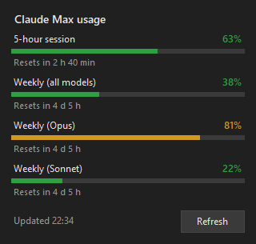
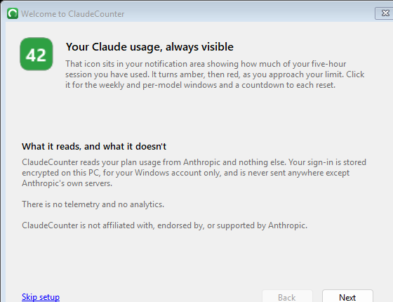
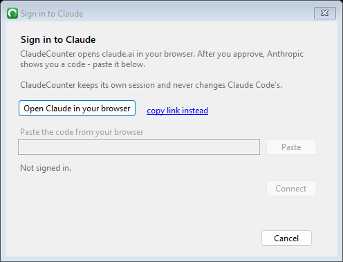
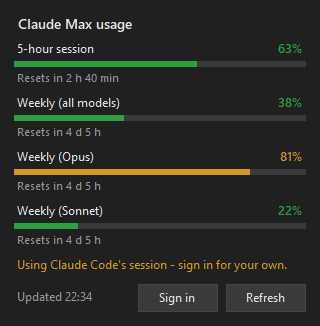
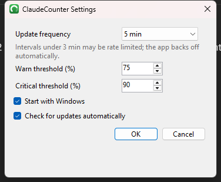

# ClaudeCounter

A lightweight system-tray monitor for your Claude (Pro/Max) plan usage, for
Windows and Linux. The tray icon shows your five-hour session utilization and
changes colour as you approach your limit; a click opens the weekly and
per-model windows with a countdown to each reset.

<p align="center">
  
</p>

[](https://github.com/6spiderman/ClaudeCounter/actions/workflows/ci.yml)
[](https://github.com/6spiderman/ClaudeCounter/releases)
[](LICENSE)
[](https://buymeacoffee.com/6spiderman)

> [!WARNING]
> **Unofficial.** ClaudeCounter is not affiliated with, endorsed by, or
> supported by Anthropic. It reads your plan usage from the same private
> endpoint the Claude Code CLI uses (`api.anthropic.com/api/oauth/usage`) and
> signs in with the same public OAuth client id the CLI embeds. These are
> undocumented and can change or be blocked at any time, which would break this
> app without warning. It is provided as-is; use it at your own risk and in
> accordance with Anthropic's terms of service. It never sends your tokens or
> usage data anywhere except Anthropic's own servers.
>
> Claude and Anthropic are trademarks of Anthropic PBC.

## Install

### Windows

Windows 10 (build 17763) or later. No admin rights, no runtime to install, no
background service.

**winget**

```powershell
winget install 6spiderman.ClaudeCounter
```

**Installer** - download `ClaudeCounter-<version>-x64-setup.exe` from the
[latest release](https://github.com/6spiderman/ClaudeCounter/releases/latest).
It installs per-user into `%LocalAppData%\Programs\ClaudeCounter`.

**Portable** - download `ClaudeCounter-<version>-x64-portable.zip`, unzip it
anywhere, and run `ClaudeCounter.exe`.

An `arm64` build is published too. It is cross-compiled and has not been run on
real arm64 hardware, so treat it as community-tested and please
[report](https://github.com/6spiderman/ClaudeCounter/issues) how it goes.

#### "Windows protected your PC"

Releases are not code-signed - a certificate costs more per year than this
project does - so SmartScreen will warn you the first time you run a new
version. Choose **More info**, then **Run anyway**.

If you would rather verify before trusting it, every release publishes
`SHA256SUMS.txt`:

```powershell
Get-FileHash .\ClaudeCounter-1.0.0-x64-setup.exe -Algorithm SHA256
```

Compare that against the release notes. Or read the source and
[build it yourself](#build-from-source) - it is a small project.

### Linux

No admin rights, no runtime to install, no background service - the same
self-contained model as the Windows build.

**deb** (Debian, Ubuntu, and derivatives)

```sh
curl -LO https://github.com/6spiderman/ClaudeCounter/releases/latest/download/ClaudeCounter-<version>-x64.deb
sudo apt install ./ClaudeCounter-<version>-x64.deb
```

**rpm** (Fedora, openSUSE, and derivatives)

```sh
curl -LO https://github.com/6spiderman/ClaudeCounter/releases/latest/download/ClaudeCounter-<version>-x64.rpm
sudo dnf install ./ClaudeCounter-<version>-x64.rpm
```

**Portable** - download `ClaudeCounter-<version>-x64-portable.tar.gz` from the
[latest release](https://github.com/6spiderman/ClaudeCounter/releases/latest),
extract it anywhere, and run `./ClaudeCounter`.

An `arm64` build is published too, in the same three forms. It is
cross-compiled and has not been run on real arm64 hardware, so treat it as
community-tested and please
[report](https://github.com/6spiderman/ClaudeCounter/issues) how it goes.

Every release also publishes `SHA256SUMS-linux.txt` alongside the Windows
build's `SHA256SUMS.txt`, if you would rather verify before trusting it:

```sh
sha256sum -c SHA256SUMS-linux.txt
```

#### No tray icon after installing (GNOME)

Stock GNOME ships no system tray at all - this is true of every tray app on
GNOME, not specific to ClaudeCounter. Install the **AppIndicator and
KStatusNotifierItem Support** extension (`gnome-shell-extension-appindicator`
on most distros, also on [extensions.gnome.org](https://extensions.gnome.org/extension/615/appindicator-support/))
and the icon will appear. KDE, XFCE, Cinnamon and MATE all provide a tray
natively and need nothing extra. If ClaudeCounter cannot detect a tray host at
all, it logs a warning and shows a one-time desktop notification saying so.

## First run

ClaudeCounter walks you through setup the first time it starts (the
screenshots below are the Windows wizard; the Linux build's onboarding
wizard follows the same three steps with its own native look).

<p align="center">
  
</p>

Signing in opens claude.ai in your browser. After you approve, Anthropic shows
you a code - paste it back into ClaudeCounter and you are done.

<p align="center">
  
</p>

You can reach this any time from the tray menu: **right-click the icon -> Sign in
to Claude...**

## Features

- **Tray icon** with the live five-hour session percentage, coloured green,
  amber or red by how close you are to your limit.
- **Flyout panel** (left-click) and **tooltip** (hover) covering the session
  window, the rolling seven-day window, the per-model windows, extra usage, and
  a countdown to each reset.
- **Signs in by itself.** No CLI required, and no re-login every few weeks -
  see [Authentication](#authentication).
- **Background polling** with automatic backoff on rate limits and network
  errors, honouring `Retry-After`.
- **Wakes with your PC** (Windows only, for now) - refreshes the moment
  Windows resumes, instead of showing stale numbers until the next timer
  tick. The Linux build just waits for its next poll, like any other app.
- **Update notifications** from GitHub Releases, at most once a day, shown as a
  menu entry rather than a popup. Off with one checkbox.
- Single self-contained executable, no telemetry. Single instance on Windows
  (a named mutex); the Linux build has no such guard yet.

## Authentication

ClaudeCounter needs an OAuth token to read your usage. It looks in three
places, in this order:

1. **`CLAUDE_CODE_OAUTH_TOKEN`** environment variable, if set. Used verbatim
   and never refreshed - useful for scripted or shared setups.
2. **ClaudeCounter's own session**, created when you sign in from the app,
   and refreshed automatically. This is the normal path. Where it is stored
   depends on the platform - see [File locations](#file-locations) - Windows
   uses [DPAPI](SECURITY.md#what-the-app-stores-and-where); Linux prefers
   your desktop's Secret Service keyring (GNOME Keyring, KWallet) and falls
   back to an encrypted file if none is available.
3. **Claude Code's session**, read from `~/.claude/.credentials.json` if you
   have the CLI installed. **Read-only** - see below. The flyout says *"Using
   Claude Code's session"* while this is in play, so you know to sign in
   properly.

<p align="center">
  
</p>

### Why ClaudeCounter keeps its own session

Anthropic **rotates the refresh token on every refresh and invalidates the old
one immediately**. Any two programs sharing one credentials file will therefore
eventually fight: whichever refreshes second presents a token the server has
already retired, gets `invalid_grant`, and is logged out permanently until you
run `/login` again. This affects
[every](https://github.com/editor-code-assistant/eca/issues/462)
[tool](https://github.com/anthropics/claude-code/issues/54443) that shares that
file.

Earlier versions of ClaudeCounter refreshed Claude Code's tokens in place and
hit exactly this. It no longer does. **ClaudeCounter never writes to
`~/.claude/.credentials.json`** - it holds a completely separate grant, with its
own refresh-token chain, so the two cannot invalidate each other. There is a
unit test asserting the file is byte-identical after a full refresh cycle.

The trade-off is one extra sign-in, from the app, once.

## Settings

Right-click the tray icon -> **Settings...**

<p align="center">
  
</p>

| Setting | Description | Default |
| --- | --- | --- |
| Update frequency | Poll interval (1, 2, 5, 10, 15, 30, 60 min). Under 3 min may be rate-limited; the app backs off automatically. | 5 min |
| Warn threshold | Session % at which the icon turns amber. | 75 |
| Critical threshold | Session % at which the icon turns red. | 90 |
| Start on login | Windows: the `HKCU\...\Run` key. Linux: an XDG autostart entry at `~/.config/autostart/`. | On |
| Check for updates automatically | Ask GitHub once a day whether a newer release exists. | On |

## File locations

### Windows

| Path | Purpose |
| --- | --- |
| `%LocalAppData%\ClaudeCounter\session.dat` | ClaudeCounter's OAuth session, DPAPI-encrypted for your Windows account on this PC |
| `%AppData%\ClaudeCounter\settings.json` | Your settings. No secrets. |
| `%LocalAppData%\ClaudeCounter\logs\claudecounter.log` | Append-only log, rolls to `.1` past ~1 MB. Never contains tokens. |
| `~/.claude/.credentials.json` | Claude Code's tokens. **Read only, and only as a fallback.** |

Uninstalling removes the first and third, and asks before removing your
settings.

### Linux

| Path | Purpose |
| --- | --- |
| Secret Service keyring (GNOME Keyring, KWallet, ...) | ClaudeCounter's OAuth session - the normal case |
| `~/.local/share/ClaudeCounter/session.dat` | The same session, AES-GCM encrypted with a key derived from `/etc/machine-id` - only used if no keyring is available |
| `~/.config/ClaudeCounter/settings.json` | Your settings. No secrets. |
| `~/.local/share/ClaudeCounter/logs/claudecounter.log` | Same rules as Windows |
| `~/.config/autostart/claudecounter.desktop` | Autostart entry, written when "Start on login" is enabled |
| `~/.claude/.credentials.json` | Claude Code's tokens. **Read only, and only as a fallback.** |

## Build from source

Needs the [.NET 8 SDK](https://dotnet.microsoft.com/download).

### Windows

```sh
dotnet test
dotnet publish src/ClaudeCounter/ClaudeCounter.csproj \
  -c Release -r win-x64 --self-contained true \
  -p:PublishSingleFile=true -p:EnableCompressionInSingleFile=true \
  -o publish
```

That produces a single `publish/ClaudeCounter.exe` with no dependencies. To
build the installer as well you need
[Inno Setup 6.3+](https://jrsoftware.org/isinfo.php):

```powershell
& "C:\Program Files (x86)\Inno Setup 6\ISCC.exe" `
  /DAppVersion=1.0.0 /DArch=x64 /DSourceDir=(Resolve-Path publish) `
  packaging\inno\ClaudeCounter.iss
```

### Linux

```sh
dotnet publish src/ClaudeCounter.Linux/ClaudeCounter.Linux.csproj \
  -c Release -r linux-x64 --self-contained true \
  -p:PublishSingleFile=true \
  -o publish
```

That produces a single `publish/ClaudeCounter` with no dependencies. To build
the `.deb`/`.rpm` as well you need [nfpm](https://nfpm.goreleaser.com/):

```sh
mkdir -p packaging/nfpm/build
cp publish/ClaudeCounter packaging/nfpm/build/ClaudeCounter
cd packaging/nfpm
VERSION=1.0.0 ARCH=amd64 nfpm package --config nfpm.yaml --packager deb --target ../../dist/
VERSION=1.0.0 ARCH=amd64 nfpm package --config nfpm.yaml --packager rpm --target ../../dist/
```

nfpm resolves paths in `nfpm.yaml` relative to wherever it is run from, not
the config file's location - it must be run from `packaging/nfpm/`, with the
binary staged at `packaging/nfpm/build/ClaudeCounter` first, as above.

## How it works

`ClaudeCounter.Core` holds everything platform-neutral (polling, the OAuth
flow, usage models, settings) and is shared, unchanged, by both front ends;
`ClaudeCounter` (WinForms) and `ClaudeCounter.Linux` (Avalonia) supply only
the UI and the platform-specific seams below it.

- `TokenProvider` resolves an access token through the three tiers above, and
  refreshes **only** ClaudeCounter's own session.
- `SignInCoordinator` drives the OAuth 2.0 authorization-code + PKCE flow with
  no knowledge of the UI, which is what makes the whole sign-in path testable
  without a browser. `SignInPanel` (Windows) and `SignInView` (Linux) are thin
  views over it, each shared by that platform's sign-in dialog and first-run
  wizard.
- `OAuthTokenEndpoint` is the only class that talks to
  `console.anthropic.com/v1/oauth/token`; the refresher and the code exchanger
  are thin wrappers so status mapping and expiry maths exist once.
- `EncryptedSessionStore` writes the session through a temp file and an atomic
  move, so a crash mid-write cannot destroy a valid session, behind an
  `IDataProtector` seam so each platform supplies its own encryption: DPAPI on
  Windows, or on Linux a key derived from `/etc/machine-id` for the file
  fallback. Anything it cannot decrypt reads as "signed out" rather than
  throwing - which is what happens if you carry a portable copy to another PC.
- `SecretServiceSessionStore` (Linux) shells out to `secret-tool` to put the
  session in the desktop's actual keyring instead, falling back to the file
  store above the first time that turns out to be unavailable.
- `UsageClient` calls `api.anthropic.com/api/oauth/usage` with a `claude-code`
  User-Agent (required: without it the endpoint applies an aggressively
  rate-limited bucket).
- `PollingService` drives an async loop on the UI thread, so consumers never
  need `Invoke` marshalling. It backs well off when only the user can fix the
  problem, instead of retrying a dead token every two minutes forever.
- `IconRenderer` draws the tray icon at runtime rather than shipping bitmaps -
  with GDI+ on Windows (destroying the unmanaged `HICON` after cloning so the
  process does not leak GDI handles on every refresh), with Avalonia's own
  drawing context on Linux.
- `TrayPresence` (Linux) checks for a tray host on the session bus at startup,
  since stock GNOME has none - see [No tray icon after installing](#no-tray-icon-after-installing-gnome).

## Project layout

```
src/ClaudeCounter.Core/   Shared, platform-neutral: polling, OAuth/PKCE, usage
                          models, settings model, logging, versioning, updates
src/ClaudeCounter/        Windows (WinForms)
  Auth/                   DPAPI's IDataProtector implementation
  UI/                     Tray flyout, dialogs, icon rendering, theme
src/ClaudeCounter.Linux/  Linux (Avalonia)
  Core/Auth/              Secret Service + machine-key IDataProtector implementations
  Settings/               XDG autostart manager
  UI/                     Tray flyout, dialogs, icon rendering, tray-presence check
tests/ClaudeCounter.Tests/
packaging/     Inno Setup script and winget manifests (Windows); nfpm config
               and the .desktop/icon it packages, plus both platforms'
               startup smoke test scripts
assets/        Icon source and generator, screenshots
```

## Support

ClaudeCounter is free and always will be. If it saves you from checking your
usage in the browser one more time, you can
[buy me a coffee](https://buymeacoffee.com/6spiderman).

## Contributing

See [CONTRIBUTING.md](CONTRIBUTING.md), and
[docs/MANUAL-TESTING.md](docs/MANUAL-TESTING.md) for the pre-release checklist.
Bug reports and PRs welcome; please read
[SECURITY.md](SECURITY.md) before reporting anything security-related, and
**redact tokens from any log you paste**.

## License

[MIT](LICENSE)
